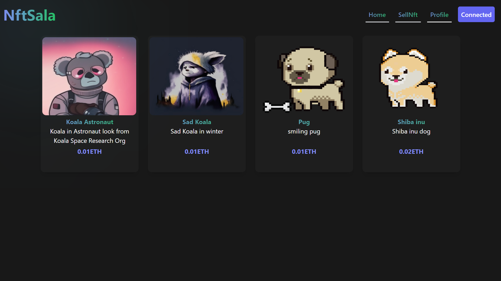
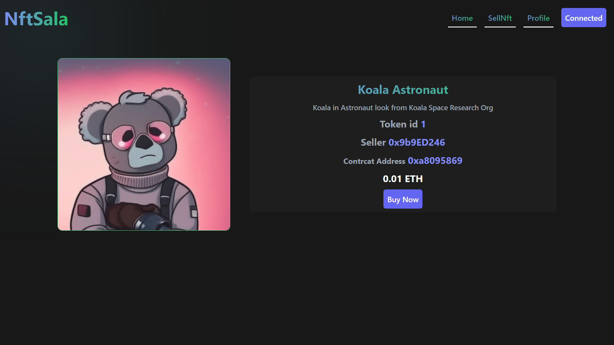
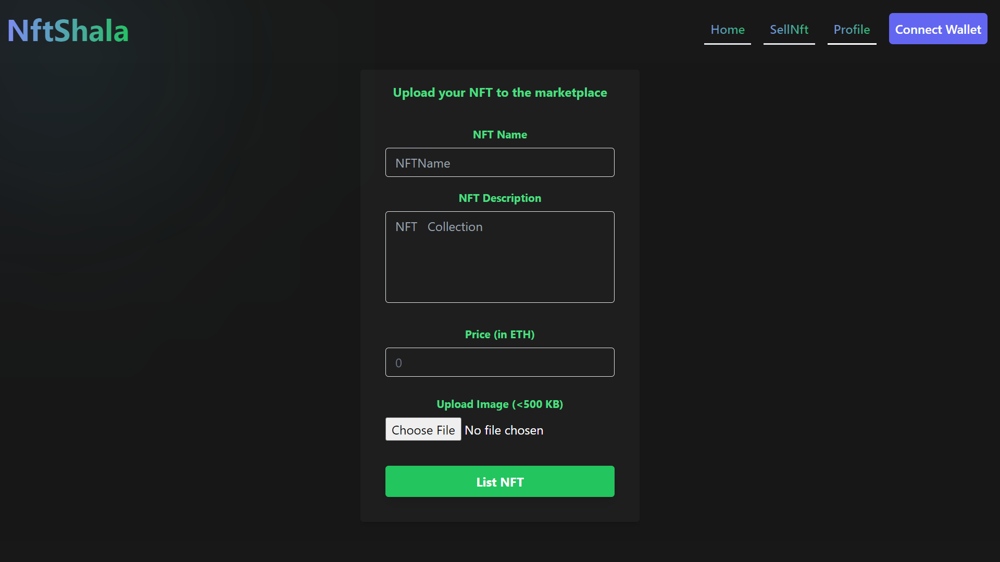
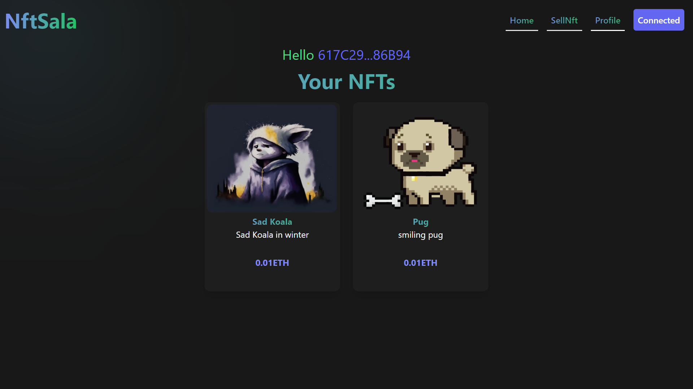

# NFT Sala is a NFT Marketplace deployed on sepolia test net
### Tech stack
   - Frontend
     - Reactjs
     - Tailwindcss
     - EthersJs(to interact with smart contract)
   - Backend
     - SmartContract
     - Hardhat(To deploy and test smart contract)

## UI ->

## Video demo

